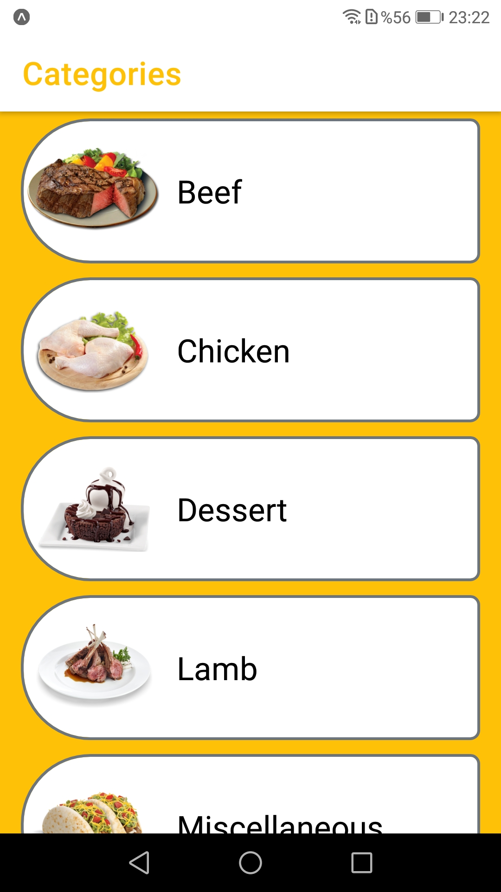
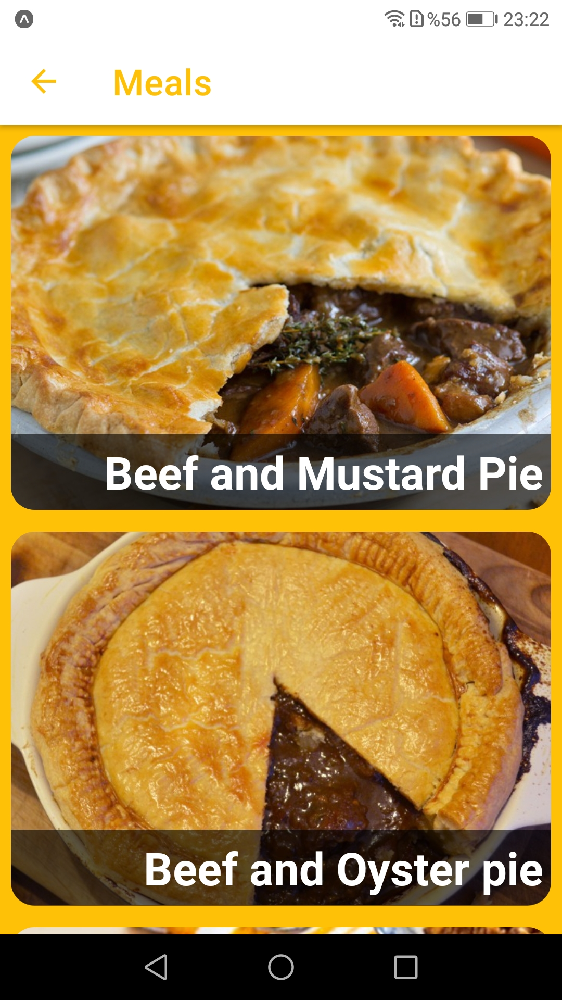
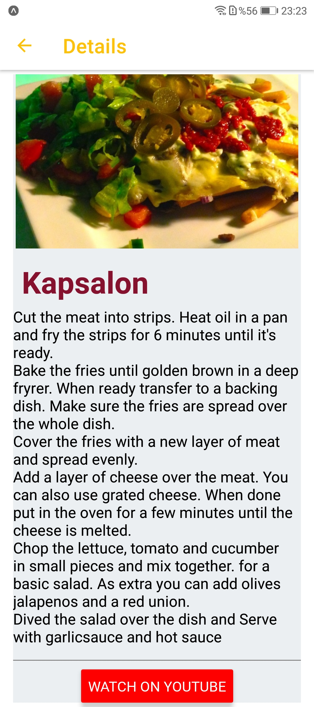

# Tarifka

- This project was created for patika.dev react-native camp homework.

# used in this project:
- React Navigation
- Sending requests to API with Axios package
- Creating Custom Hooks
- Using Lottie animation packs

